# Mini rapport d'analyse statique APK

**Auteur :** CHARRAJ Mouad aka ZERO-XR7  
**Outil principal :** MobSF v4.0.6  
**Date d'analyse :** 26/04/2026

## 1. Contexte
Cette analyse statique a ete realisee sur l'APK `phone-check-and-test.apk` dans un cadre pedagogique, via l'environnement Mobexler et l'outil MobSF. L'objectif etait d'identifier les points de faiblesse visibles sans execution de l'application.

## 2. Informations generales
- **Nom de l'application :** Phone Check and Test
- **Package :** `com.inpocketsoftware.andTest`
- **Activite principale :** `com.inpocketsoftware.andTest.ScrollingActivityStart`
- **Version Android de l'application :** 14.4
- **Version code :** 144
- **Target SDK :** 31
- **Min SDK :** 17
- **Taille de l'APK :** 3.35 MB
- **Score MobSF :** 55/100
- **SHA-256 :** `5790b3127d661e2dab4ca73d691ff4093f13b9bdebabec0ef74adfb762944cf2`

## 3. Resume executif
L'application presente un niveau de risque **moyen**. Le rapport MobSF met surtout en avant trois points sensibles : l'usage d'un mode de chiffrement CBC avec padding PKCS5/PKCS7, l'ecriture et la lecture de donnees sur le stockage externe, ainsi qu'une compatibilite avec des versions Android anciennes et vulnnerables. Les permissions observees montrent aussi un acces a plusieurs ressources sensibles comme la localisation, la camera, le stockage et l'etat du telephone.

## 4. Resultats principaux

### 4.1 Chiffrement CBC avec PKCS5/PKCS7
- **Severite :** Elevee
- **Reference :** CWE-649, OWASP MASVS `MSTG-CRYPTO-3`
- **Constat :** MobSF signale l'usage du mode CBC avec padding PKCS5/PKCS7 dans `com/inpocketsoftware/andTest/ScrollingActivitySysInfoSensors.java`.
- **Risque :** Ce choix cryptographique ne garantit pas l'integrite des donnees chiffrees et peut exposer l'application a des attaques de type padding oracle selon le contexte d'utilisation.
- **Recommandation :** Remplacer cette implementation par un mode chiffre authentifie, par exemple AES-GCM, avec gestion correcte des IV et de l'integrite.

### 4.2 Lecture/ecriture sur le stockage externe
- **Severite :** Moyenne
- **Reference :** CWE-276, OWASP Top 10 Mobile M2, OWASP MASVS `MSTG-STORAGE-2`
- **Constat :** MobSF indique que l'application peut lire et ecrire sur le stockage externe. Les traces pointent notamment vers `com/inpocketsoftware/andTest/aa.java` et `com/inpocketsoftware/andTest/f.java`.
- **Risque :** Les donnees enregistrees sur un stockage externe peuvent etre lues, modifiees ou supprimees par d'autres applications disposant des droits adequats.
- **Recommandation :** Eviter le stockage externe pour les donnees sensibles et privilegier le stockage interne prive ou un mecanisme chiffre cote application.

### 4.3 Compatibilite avec des versions Android anciennes
- **Severite :** Elevee
- **Reference :** Manifest Analysis MobSF
- **Constat :** L'application peut etre installee a partir d'Android 4.2-4.2.2 via un `minSdk=17`, ce qui laisse ouverte l'execution sur des systemes ne recevant plus de correctifs suffisants.
- **Risque :** L'application peut tourner dans un environnement deja vulnerables, ce qui augmente la surface d'attaque globale meme si le code applicatif n'est pas directement fautif.
- **Recommandation :** Relever le `minSdkVersion` vers une version Android plus recente et alignee avec un niveau de correctifs acceptable.

### 4.4 Signature v1 exposee a Janus
- **Severite :** Moyenne
- **Reference :** Certificate Analysis
- **Constat :** MobSF signale une signature v1 pouvant rendre l'application vulnerable a Janus sur certains terminaux Android 5.0 a 8.0 si elle n'est signee qu'avec ce schema.
- **Risque :** Un attaquant pourrait profiter d'un ancien schema de signature pour contourner certaines verifications sur des versions Android precises.
- **Recommandation :** Signer l'application avec des schemas modernes v2/v3 et verifier la configuration de build de publication.

### 4.5 Journalisation d'informations sensibles
- **Severite :** Information / a surveiller
- **Reference :** CWE-532, OWASP MASVS `MSTG-STORAGE-3`
- **Constat :** MobSF releve des traces de journalisation dans `AudioTest.java`, `ScrollingActivityResults.java` et `a.java`.
- **Risque :** Des informations de debug ou des donnees applicatives peuvent fuiter dans les logs et etre recuperees sur un appareil compromis ou en phase de test.
- **Recommandation :** Nettoyer les logs avant diffusion et desactiver toute journalisation sensible en build de production.

## 5. Permissions et composants observes
### Permissions sensibles relevees
- `android.permission.ACCESS_FINE_LOCATION`
- `android.permission.CAMERA`
- `android.permission.READ_EXTERNAL_STORAGE`
- `android.permission.READ_PHONE_STATE`

### Permissions reseau et systeme visibles
- `android.permission.INTERNET`
- `android.permission.ACCESS_NETWORK_STATE`
- `android.permission.ACCESS_WIFI_STATE`
- `android.permission.BLUETOOTH`
- `android.permission.BLUETOOTH_ADMIN`
- `android.permission.NFC`

### Composants
- **Activities detectees :** 26
- **Services detectes :** 0
- **Receivers detectes :** 0
- **Providers detectes :** 1
- **Browsable activities :** aucune visible dans le rapport
- **Composants exportes visibles :** aucun export explicite releve sur les captures exploitees

## 6. Configuration reseau et ressources
- La section **Network Security** ne remonte pas d'alerte particuliere sur les captures disponibles.
- La section **Domain Malware Check** ne signale pas de domaine marque comme malveillant.
- Domaines visibles dans le rapport : `inpocketsoftware.com`, `www.inpocketsoftware.com`, `open.spotify.com`, `play.google.com`, `www.w3.org`.
- La section **Possible Hardcoded Secrets** affiche surtout des chaines liees a la localisation de l'application, ce qui ressemble davantage a des faux positifs qu'a de vrais secrets exploitables.

## 7. Correlation rapide avec OWASP MASVS
| Observation | Reference MASVS | Interpretation |
|---|---|---|
| Journalisation d'informations applicatives | `MSTG-STORAGE-3` | Les donnees sensibles ne devraient pas se retrouver dans les logs |
| Stockage externe accessible | `MSTG-STORAGE-2` | Le stockage des donnees doit limiter l'exposition aux autres applications |
| Chiffrement CBC avec PKCS5/PKCS7 | `MSTG-CRYPTO-3` | Les mecanismes cryptographiques doivent proteger confidentialite et integrite |

## 8. Recommandations prioritaires
1. Remplacer le chiffrement CBC/PKCS5-PKCS7 par une solution moderne de type AES-GCM.
2. Supprimer l'usage du stockage externe pour toute donnee sensible ou technique.
3. Relever le `minSdkVersion` pour eviter l'installation sur des versions Android trop anciennes.
4. Nettoyer les traces de log avant livraison et desactiver les logs sensibles en production.
5. Verifier la signature finale de l'APK et privilegier les schemas v2/v3.

## 9. Conclusion
L'analyse montre une application fonctionnelle mais encore marquee par plusieurs choix techniques perfectibles du point de vue securite. Le risque principal ne tient pas a un unique defaut critique, mais a l'accumulation de mauvaises pratiques sur le chiffrement, le stockage et la compatibilite avec des plateformes anciennes. Une correction de ces points permettrait d'ameliorer sensiblement le niveau de securite global.

## 10. Captures
### Connexion et lancement
![Connexion MobSF]

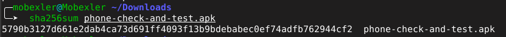

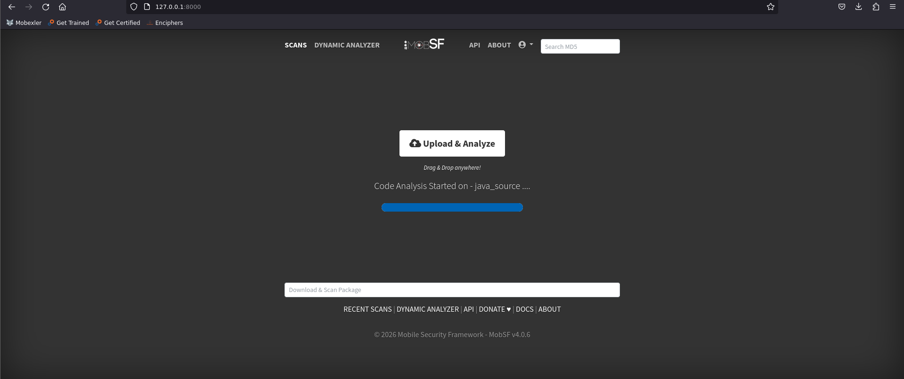

### Tableau de bord et permissions
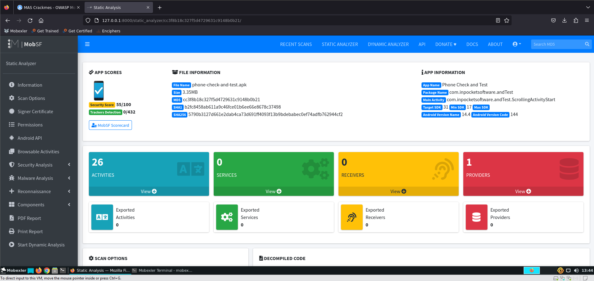

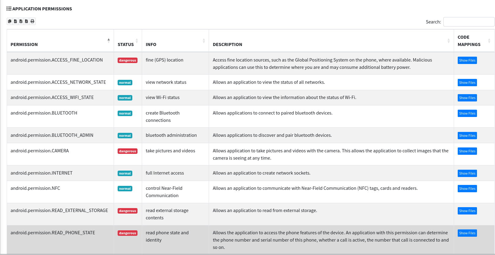

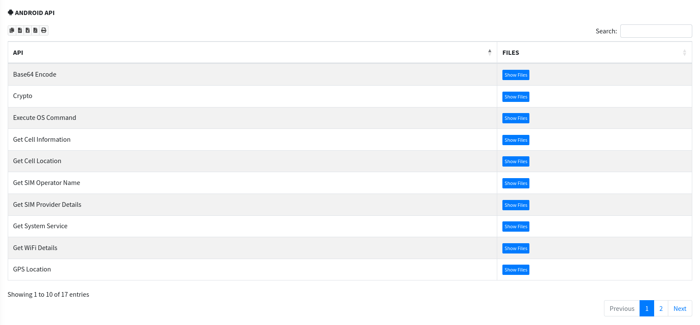

### Analyse securite
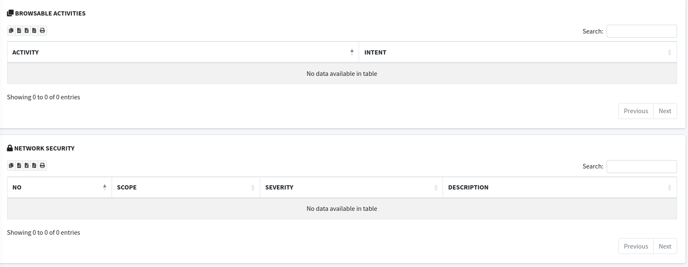

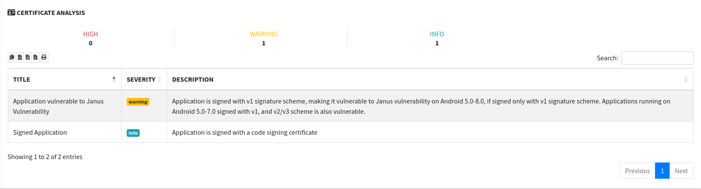

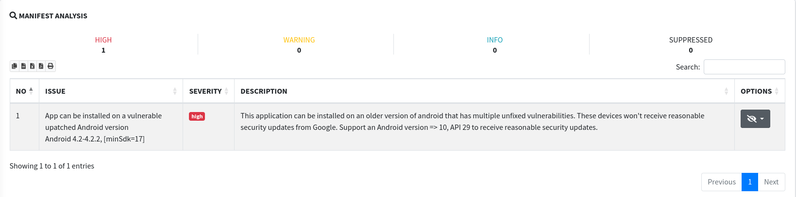

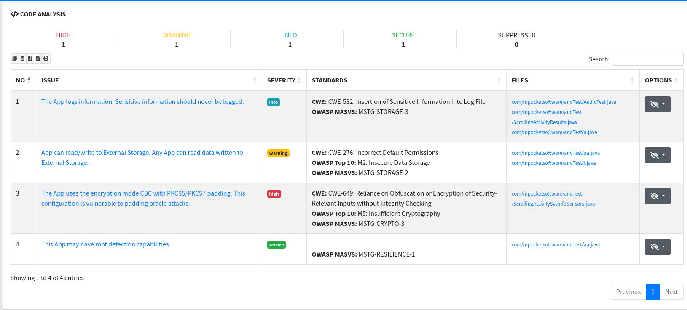

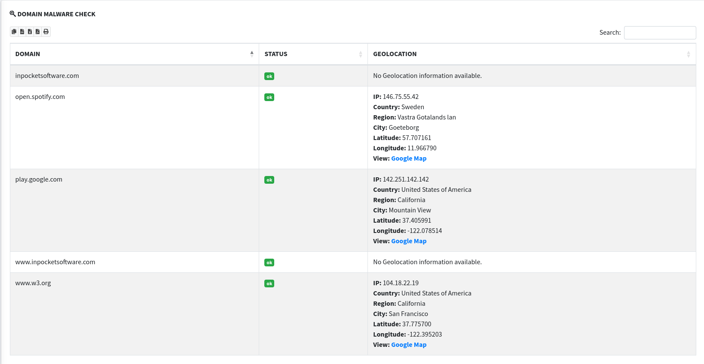

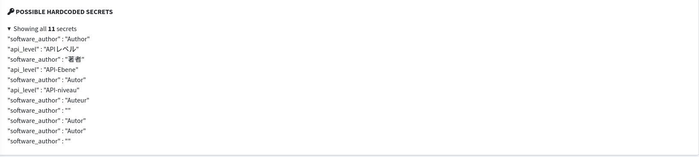

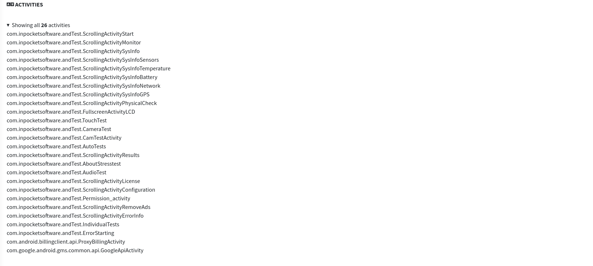
